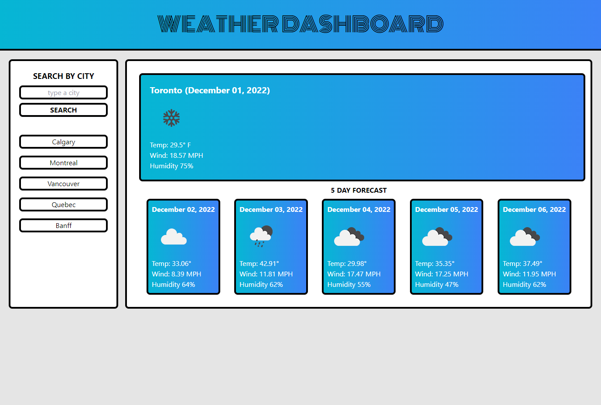

# WEATHER DASHBOARD

# Link

https://williamgeorgethomas.github.io/weather-dashboard/

# Purpose

This application was created to display the current weather and 5 day forecast for any city the user chooses.  There is a search bar for user input and each user search is saved to local storage.  Then the most recent 5 searches are displayed on buttons below the search bar.  When a button is clicked, the search is performed again for that city.

# My Experience

This was the most challenging project yet.  It required signficant use of JavaScript and my first time using an API.  Navigating the API data as well as local storage and event listeners was difficult.  Finally, I used TailWind CSS to style the application.  It was my first time using a CSS framework and it was fun and easy to use after much trial and error.

# Screenshot

# Credits

Created by William George Thomas, 2022
